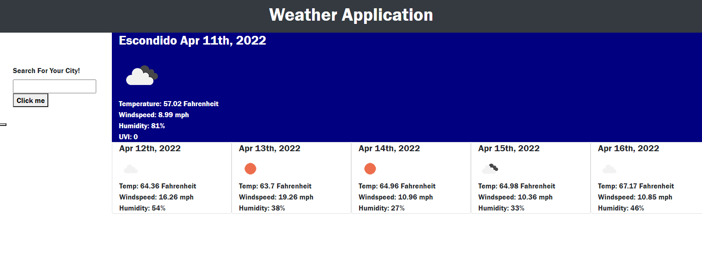

# forecast-weather-application

## Description
This application provides information about the weather in a specific location.  A user can type a city in and see the current weather, as well as a forecast for the next fice days.  

## Contributors
I wrote the code, but worked with Sam to fix a couple of parts.  Also received help at office hours from John and TA Michael.

## Usage
To use the app, open it and type a city you would like to know the weather for into the search box.  Then hit search.  See the screenshot below as a reference.

## License
Matt Carlson Code 2022